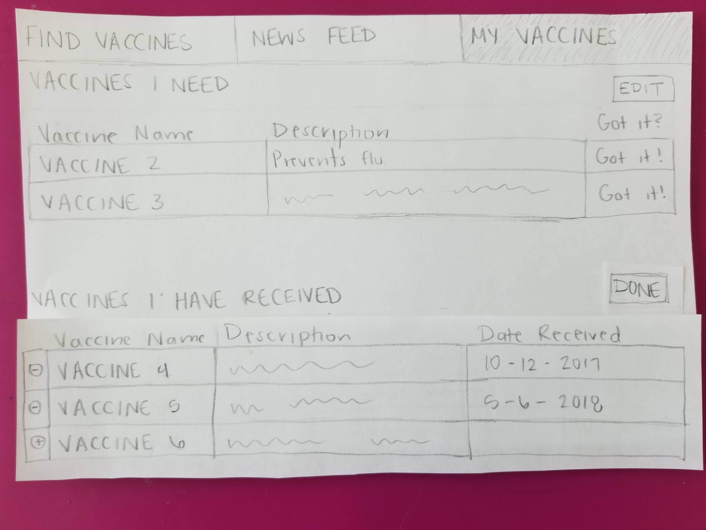
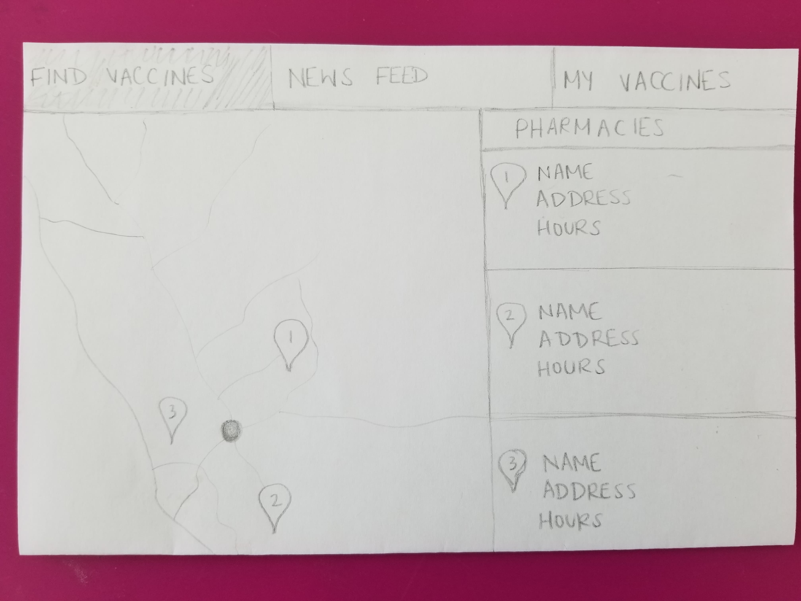

# Team name: 
Daily Silly
# Team members: 
Jen-Jun Yen, Shiva Sharma, Prabhav Khandelwal, Dylan Hua

# Project idea 1: My Vaccine
Our app is designed for people who have a hard time tracking what kind of vaccine they need based on their age, gender, and medical history. Unlike us, many people out there don’t schedule regular check-up with doctors and lack the knowledge of what kind of vaccines they need at the time. This app can help elderly people with weak immune systems make better health decisions. This app can also help parents with newborns to better keep track of their kids’ vaccines records and schedules. 
We plan to use Google Map API to show users the nearby location that they can get the vaccine they needed. We also plan to use real life data sets with vaccines-related information to guide our users about what the vaccine is for and when it should be received. We also plan to incorporate News API to help the users to stay on current trends.
None of our teammates are a target audience for this app because none of us are parents or elderly.

# Project idea 2: DogMate
Dog owners/parents sometimes have difficulties finding the right partner for their dogs to breed. They are looking at factors like age, breed, locality, etc. for selecting a suitable partner for their dog. DogMate will serve as a database of eligible dogs around a certain locality based on your age/breed preference who are also looking to mate. 
We plan to use the Google Maps API to figure out distance between suitable matches which will help dog parents/owners determine if it is a feasible match.
None of our teammates are the target audience for the app because none of us are dog owners/parents.
*Possible Pivot*: An app for people to find adoptable pets and rescue them. We can use the [Adoptable Pet Data API](https://rescuegroups.org/services/adoptable-pet-data-api/) for that.

# Project idea 3: Rate Music
Music listeners who want to listen to songs that are new to them may not know where to start without investing a lot of time into researching what new music may appeal to them. By having the ability to see what other listeners think about a song, an adventerous listener can find new songs of interest.
We can use Spotify's API to request information about songs when a user looks one up. We can also pull playlists of popular songs from Spotify to give users a starting point. 
Our group members tend to know exactly what music genres they like and rarely step out of their comfort zones to explore new music.

### Storyboards
#### Storyboard 1 (for vaccination app): 
The user does not know whether they are up to date on a certain vaccine, but with the web app, they can make sure they have that information on hand.

#### Storyboard 2 (for dog mating app):
A dog parent is specifically looking for a *female Beagle* to mate with for his dog Simba, but can't find one of suitable age. He uses the DogMate app to find a *female Beagle* of suitable age and within his locality.

#### Storyboard 3 (for music rating app):
The user knows what type of music they want to listen to but does not know which specific songs to listen to. He can figure out which songs to try out by looking at the reviews and ratings others have made for songs, and he can save those.

### Prototypes
#### Prototype 1 (for vaccination app):
The user has the ability to search for the nearest pharmacies to get vaccinated. They can find out what vaccines they need with a questionnaire and also view news about health issues in their area. 

---

---

---

---

---

#### Prototype 2 (for vaccination app):
- On the home page, the parent can login and see the recently completed and upcoming vaccinations for their child.
- On the profile page, the parent can edit details about their child like age, gender and their medical history.
- On the records page, the parent can see an exhaustive list of completed and upcoming vaccinations.
- On the settings page, the parent can choose to link their account with Google/Facebook and adjust miscellaneous app settings.

---

---

---

#### Prototype 3 (for vaccination app):
This prototype is similar in function to Prototype 1, but provides a more condensed UI. The user only has to deal with two web pages, and the map to find close pharmacies is displayed on the same page as the user's list of vaccines.

---

---

#### Prototype 4 (for music rating app):
With the music rating app, the user can rate songs to keep track of everything they have listened to and stay organized. They can search for a specific song to rate as well. The user can view details about a song and leave reviews.

---

---

---

---

