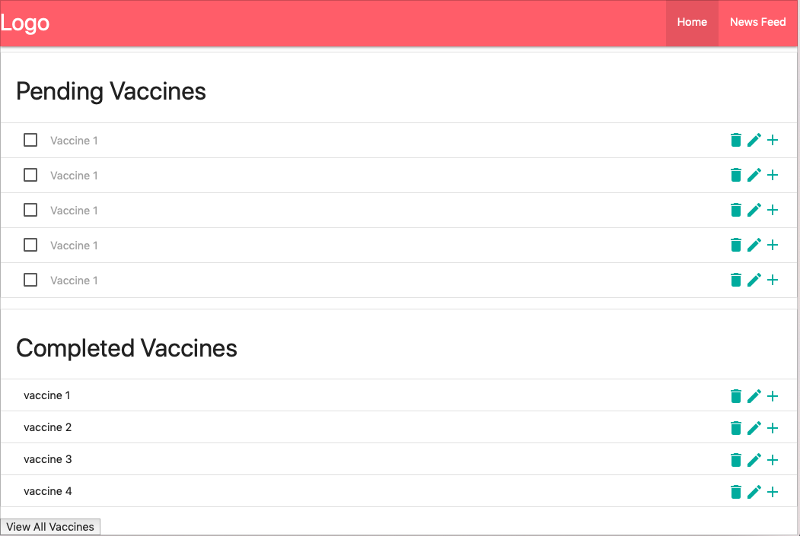
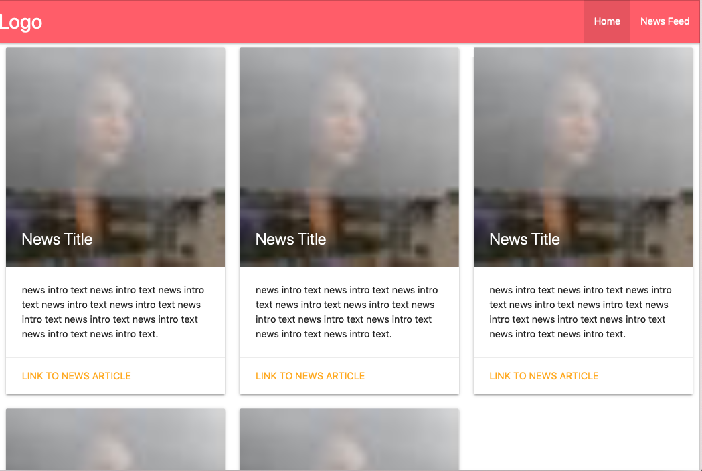

# Milestone 2

After reviewing the feedback from the TA, we decided to go with the vaccine idea and narrow down our target users to parents with newborns. The app can help parents to keep track of their children’s vaccine records and schedules. 

## App screenshots

For the design of our app, we decided to follow the general outline present in our prototype 1. The user will be presented with two tables of vaccines, one table for vaccines their child needs to receive and the other for vaccines the child has already received. Unlike our prototypes, we did not include the map feature to find pharmacies close to the user. This is because there are already existing websites/apps (Google Maps) that provide similar functions and we also want to focus on presenting the vaccine record information to our users. 

The first screen put the users' vaccine records into two tables, pending vaccine and completed vaccine. Users can also perform CRUD actions on contents of the tables. Additionally, the users can check off a vaccine once their child has gotten it and it will move to the Completed table.

The second screen will include latest news related to vaccine information or health issues in the regions that we will fetch using News API.

## API/Real Data
Going forward, we plan to use News API for the contents under the News tab. As for the vaccine information, we plan to collect
the data from the CDC website and then formate the data. 
