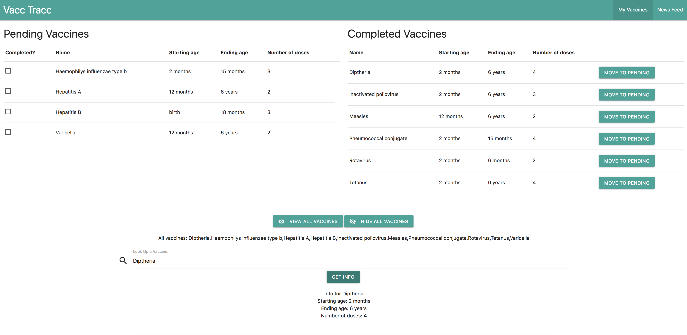

# Milestone 3

**Summary**: Used APIs and back-end data and visually structured it in the front-end for better presentation and added search functionality in the news page.

## App screenshots

### Home Page
- We've redesigned the homepage in a way that the two sections, *Pending* and *Completed* vaccinations are displayed separately as well as important details such as *starting age*, *ending age*, *number of doses* are clearly displayed for reference.
- Users can also check off a vaccine from the *pending* list which will directly send it to the *completed* list.
- We have also applied basic styling to the bottom section of the page, including buttons to *look up* and *hide* all vaccines as well as the field and button to get additional information about the vaccine.

### News Page
- We've populated data in the news page using the [News API](https://newsapi.org/) which would display relevant news information about the topic of vaccines.
- We have also added *search* functionality so a user can also search for news article relating to a certain subtopic under vaccines.

## API/Real Data Usage
- We used the News API for displaying news articles on the news page for the following reasons:
    - Ease of use
    - Active community support
    - Multiple platform support
- For the list of vaccines on the homepage, we are using a database constructed in Firebase and then using AJAX calls to utilize the data in the front-end.

### Possible Future Data Use 
We plan to incorporate functionality in the homepage so that the user can:
- add their own custom Vaccines
- edit existing vaccine data if necessary
- delete a vaccine if it doesn't apply to the patient
