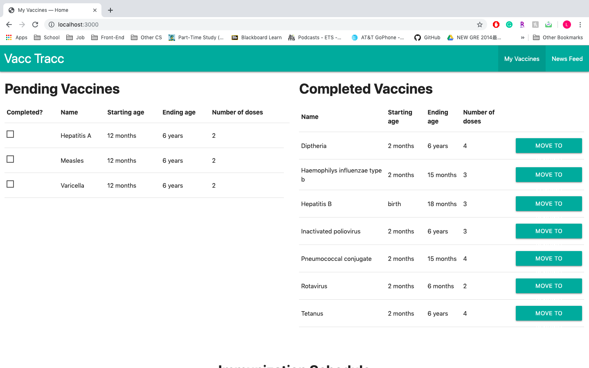

# Milestone 5

### Home Page

### News Page

We updated the News page to make sure that every card and image is unified and aligned properly. 
We also delete the "LINK TO NEWS ARTICLE" part and replaced with the click-able news title 
that will take the users to the original news article

### Description

Having a newborn baby in the house is often overwhelming for the parents. Besides making sure 
everything is fine at home for the baby, parents also need to take the baby to doctors for 
various different vaccinations. It's easy for parents to lose track of the vaccination schedule 
or miss getting enough doeses consider the large amount of vaccinations baby needs to get and the 
already crazy schedule with having a baby.
With Vacc Tracc, parents can now easily track the which vaccines are completed and which are not. Parents
can also use Vacc Tracc to follow up with the newest infomation regard vaccine around the world to 
keep the baby safe. 

### Data Visualization

For the data visualization, we implmented a timeline that retrive data 
from the database and shows the users the time length of the start and end age 
of each vaccine as well as the number of doeses needed so the users can get a clear
overview of the vaccine schedule. 

### Possible Future Data Visualization Implementation 

In the future, we can potentially expend on the time line to not only 
shows the users the time range and does number of each vaccines but further
plan for the users when each shot of different vaccine should be taken based
on their schedule 
