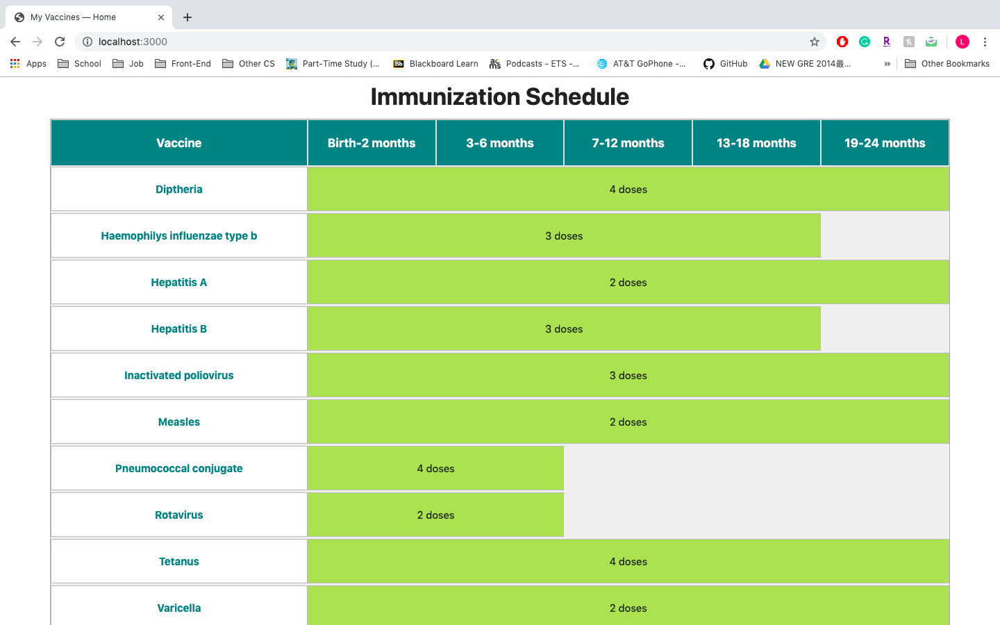

# Milestone 5

### Home Page

### News Page

We updated the News page to make sure that every card and image is unified and aligned properly. 
We also delete the "LINK TO NEWS ARTICLE" part and replaced with the click-able news title 
that will take the users to the original news article

### Description

Having a newborn baby in the house is often overwhelming for the parents.
Besides making sure everything is fine at home for the baby, parents also need to take the baby 
to the doctor for vaccinations. With the crazy schedule, it's easy for parents to lose track. 
With Vacc Tracc, parents can easily track the kid's vaccine record as well as keep up with the 
newest infomation. 

### Data Visualization

### Possible Future Data Visualization Implementation 

