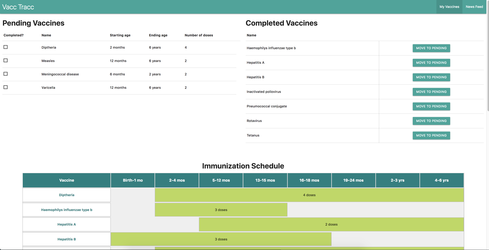
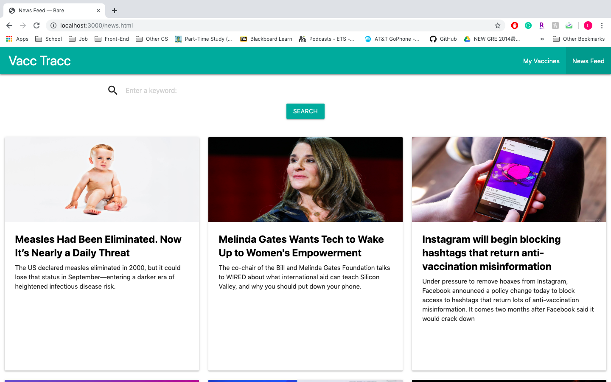
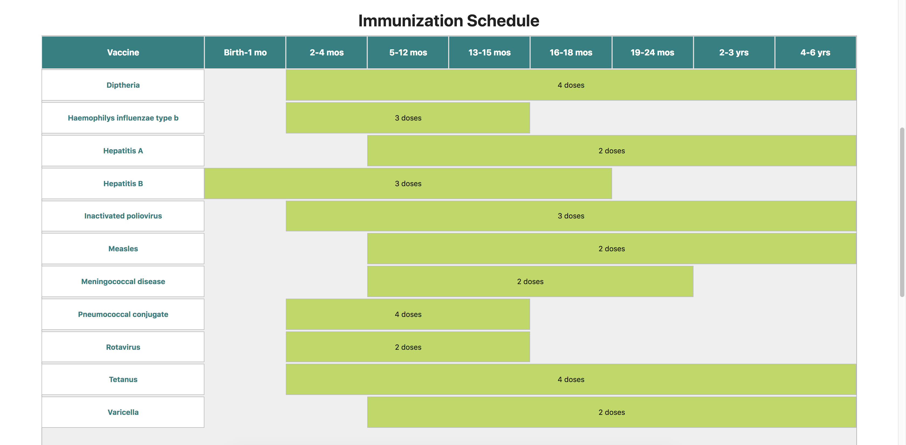

# Milestone 5

### Home Page

The Completed Vaccines table on the Home page was updated so that the same information was not
repeated. Previously, the Pending and Completed tables both listed the starting age, ending age,
and number of doses for the vaccine. However, it is not necessary to duplicate this information
in two tables, especially once the vaccine has been completed, so this information was removed
for a cleaner user experience.

### News Page

We updated the News page to make sure that every card and image is unified and aligned properly. 
We also delete the "LINK TO NEWS ARTICLE" part and replaced with the click-able news title 
that will take the users to the original news article

### Description

Having a newborn baby in the house is often overwhelming for the parents.
Besides making sure everything is fine at home for the baby, parents also need to take the baby 
to the doctor for several different vaccinations. With the crazy schedule, it's easy for parents to lose 
track of which vaccinations need to be done and which are completed, not to mention the different 
number of doses for each immunization and the proper ages to get certain vaccines. 
With Vacc Tracc, parents can easily track their child's vaccine record as well as keep up with the 
newest infomation on outbreaks and general news to keep their child safe. 

### Data Visualization

For the data visualization, we implmented a immunization schedule that retrieves data 
from our Firebase database and shows the users the recommended age ranges for each 
vaccine in the form of a timeline. This allows the users to see not only when to start 
and end each vaccine, but also how the process is spread out over a certain time 
period, given the total number of doses required for each vaccine.

### Possible Future Data Visualization Implementation 

In the future, we can potentially expend on the time line to not only 
shows the users the time range and dose number of each vaccines, but further
plan for the users when each shot of different vaccine should be taken based
on their schedule.
A more detailed visualization would include more specific ages so that the
age ranges of vaccination are smaller and more clear to the user. Also, a 
schedule that includes the age ranges for catching up on immunization and/or
ranges for high-risk groups would help more users that have different needs.
The chart could also be made interactive, by allowing a user to check off on
the chart when they got the vaccination done so they can compare their timing
to the official CDC recommendations. 
